<div align="center">

# Lumen

**OpenTelemetry-native observability in one binary.**<br>
Traces, logs and metrics, dashboards you build yourself, host / service / Docker / Nextcloud monitoring, users and groups, and automatic backups of old data.

[](https://github.com/danielingemar/lumen/actions/workflows/ci.yml)
[](LICENSE)


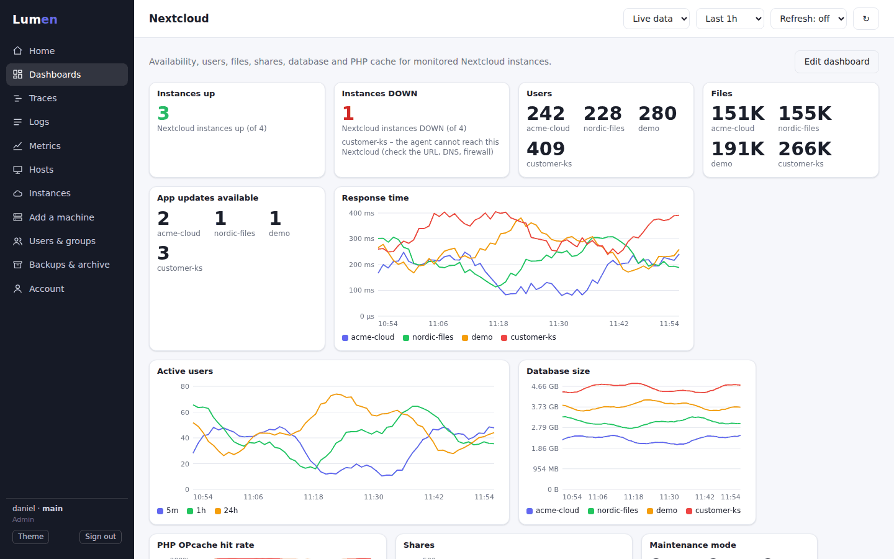

*Lumen is a working name.*

</div>

> **Status: early MVP.** Ingest, search, charts, dashboards, agents, status (up/down), users and groups, remote agent configuration, retention and backup all work. There is **no alerting and no PromQL yet** (see the [roadmap](#roadmap)). The Elasticsearch, Docker, systemd, Windows and Nextcloud integrations are covered by unit and fake-service tests; check them against your own setup first.

---

## Contents

- [Features](#features) · [Screenshots](#screenshots) · [How it fits together](#how-it-fits-together)
- [Quick start](#quick-start) · [Install on a server](#install-on-a-server) · [Upgrade](#upgrade)
- [Add machines](#add-machines) · [Hosts, instances and remote configuration](#hosts-instances-and-remote-configuration) · [Nextcloud monitoring](#nextcloud-monitoring)
- [Status and "Down"](#status-and-down) · [Labels](#labels)
- [Users, groups and permissions](#users-groups-and-permissions) · [Login, keys and security](#login-keys-and-security)
- [Retention, backup and archive](#retention-backup-and-archive)
- [Editions and design documents](#editions-and-design-documents) · [Configuration](#configuration) · [API](#api) · [Development](#development) · [Contributing](#contributing) · [Roadmap](#roadmap)

## Features

| | |
|---|---|
| **Dashboards you build** | Line, area, stacked bar, single value, table, log and trace panels. Pick metric, aggregation, *split by* label, label filters, unit and size; drag to reorder; live preview. Starter dashboards: **Hosts**, **Nextcloud**, **Services (traces)**, **Logs**. |
| **Up / Down at a glance** | Boxes for Nextcloud instances, hosts, systemd services and Docker containers. A *Down* box shows a green **0** when all is well and turns red, with names and reasons, when something is not. |
| **Alerts that reach people** | Rules on metrics, up/down status and log counts; notifications by **email, webhook, Slack, Teams**, and in Enterprise **Jira, ServiceNow, PagerDuty, Opsgenie**. Grouping, retries, acknowledge, silences, a replay of the last 24 hours before you save a rule. |
| **Hosts & Instances pages** | See every machine and Nextcloud instance. Rename hosts, remove old ones, add log paths, choose watched services, fix a mistyped Nextcloud URL, **all in the browser**: agents pick up the change within a minute. |
| **Dropdowns of everything that comes in** | Traces, Logs and Metrics list every service, operation, log source, host and metric Lumen has received, so you pick instead of typing. |
| **Your own logo** | Upload a logo and site name under **Settings**; they show in the menu, in the browser tab (as the tab icon) and on the login page. |
| **Everything about a host** | Open a host to see CPU (also by state: user, system, iowait, steal), load, memory (used, cached, buffers, free), swap, usage of every local disk, **disk I/O** (throughput, IOPS, busy time per device), **network** traffic and errors, processes and uptime, as charts over the chosen time range. |
| **Services on your machines** | systemd units and Docker containers are reported automatically (`system_service_up`, `container_up`). |
| **Users and groups** | *Admin* (everything), *User* (read-only) and *custom* groups with none / read / write per area. Enforced by the server. |
| **Retention and archive** | 30 days of live data. Every day is backed up before it expires and can be loaded back and browsed in the UI at any time. |
| **Traces, logs, metrics** | OTLP/HTTP JSON ingest, trace waterfall, log search, metrics explorer with a **Labels** box. |
| **One-command agents** | Linux (systemd), Windows, Docker. Host metrics, Prometheus scraping, log tailing, Nextcloud checks, self-metrics. |
| **Multi-tenant from day one** | The tenant comes only from the authenticated user or key. Every row is written with it, every query filters on it. |

## Screenshots

| | |
|---|---|
| 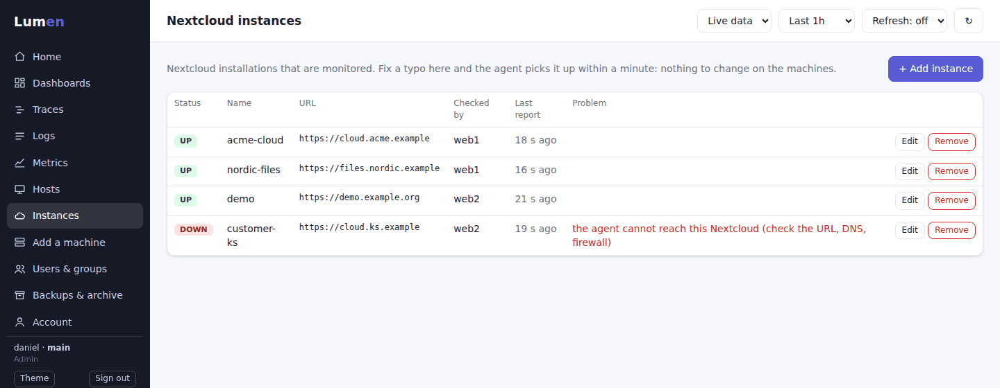 **Instances**: a down instance and why. Fix a typo and the agent picks it up. | 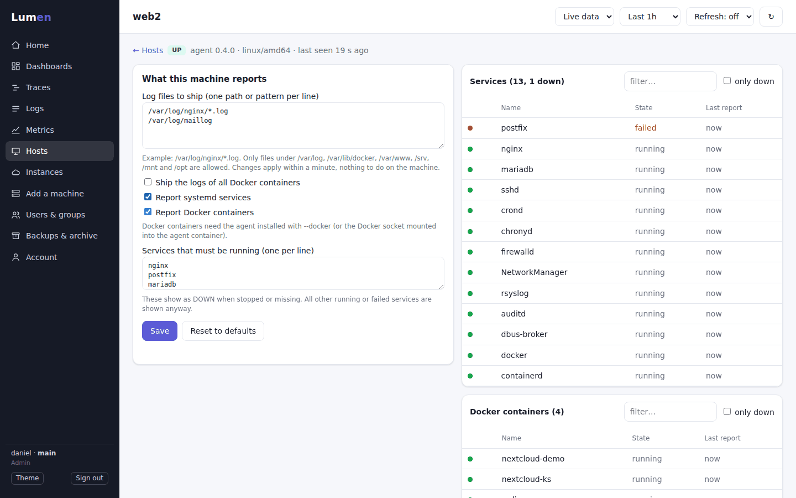 **Hosts**: log paths, watched services, systemd services and Docker containers. |
| 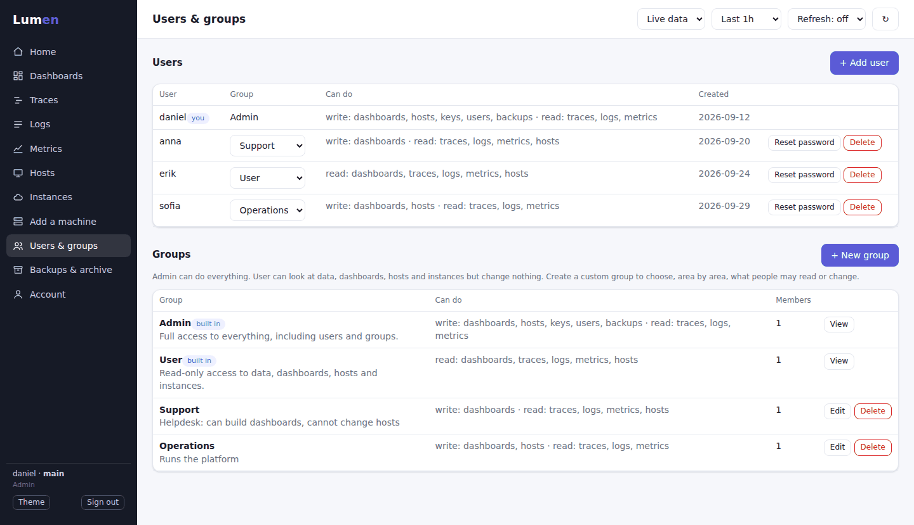 **Users & groups**: Admin, User and custom groups. | 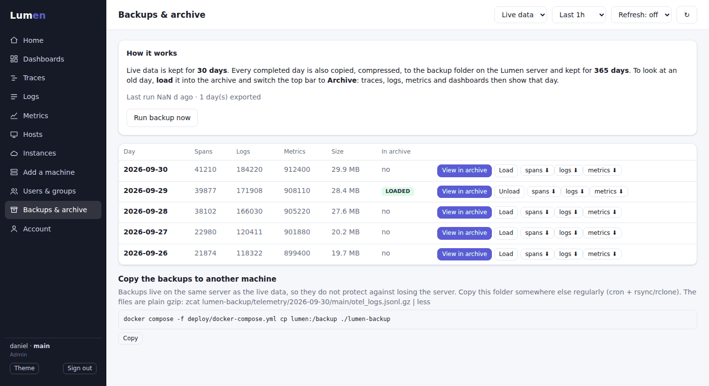 **Backups & archive**: every day is backed up; load an old day and browse it. |
| 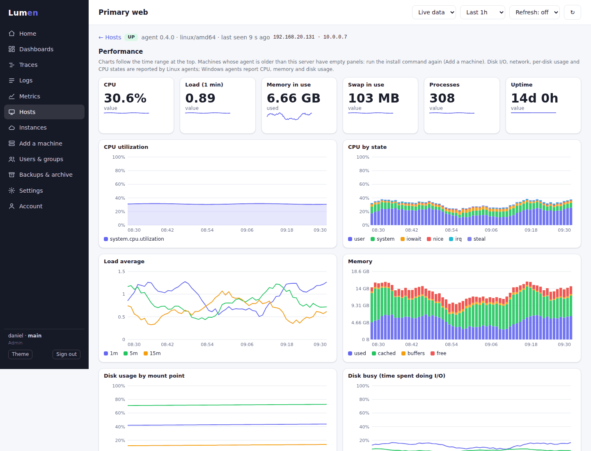 **Host page**: CPU, load, memory, disks, disk I/O and network for one machine. |  Below the charts: settings and services. |
| 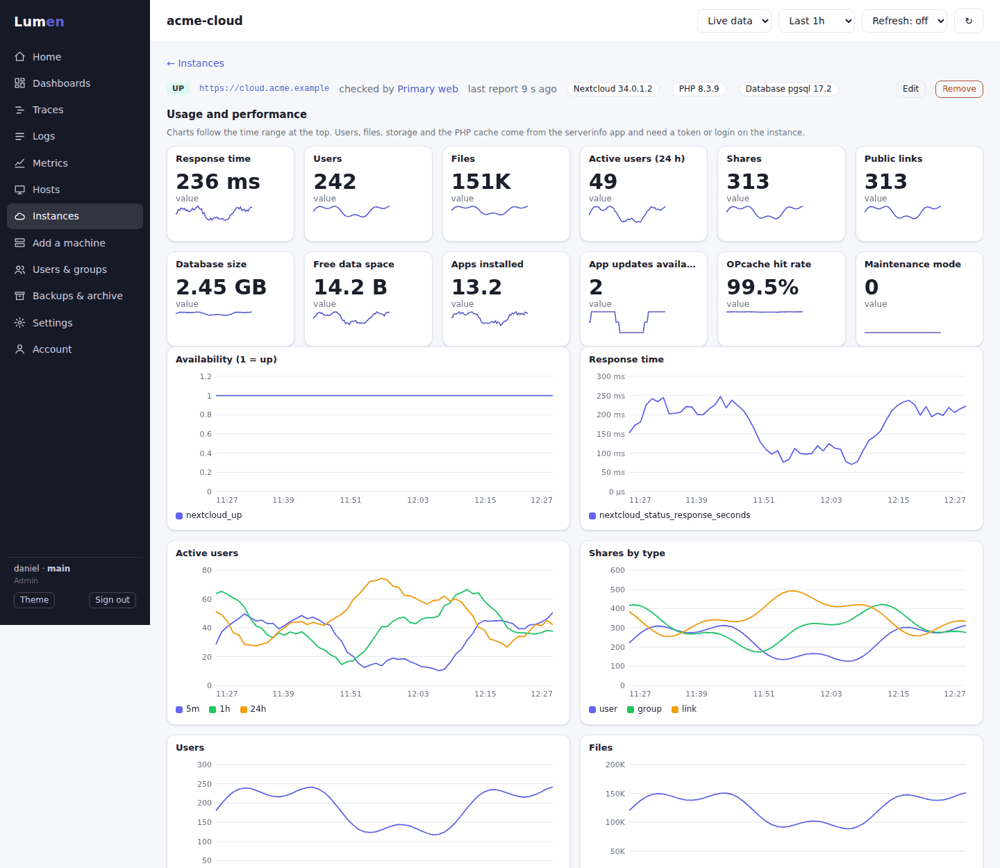 **One instance**: status, versions, usage and performance, and its log. | 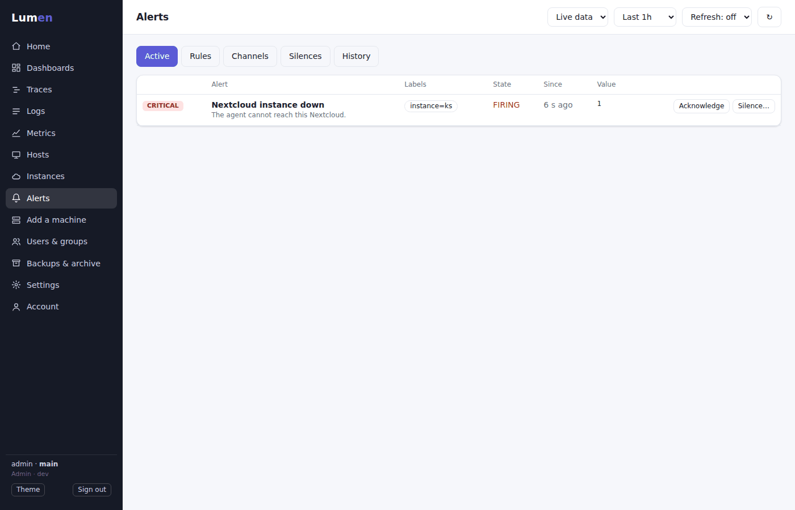 **Alerts**: what is firing, with Acknowledge and Silence. | 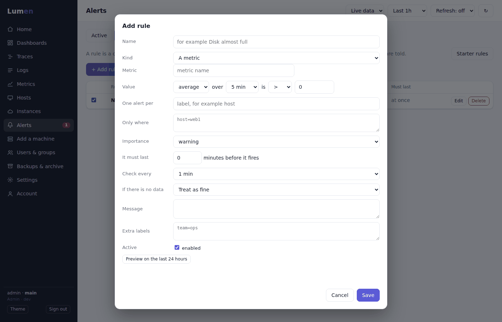 **Rule editor**, with a replay of the last 24 hours. |
| 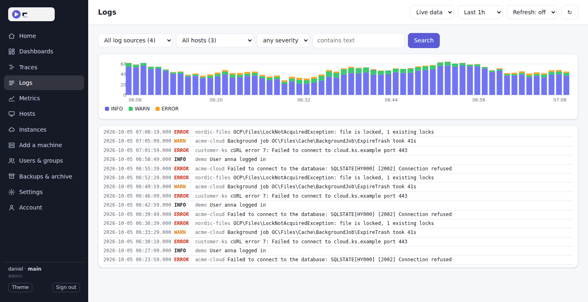 **Logs**: pick a log source and a host from what has come in. | 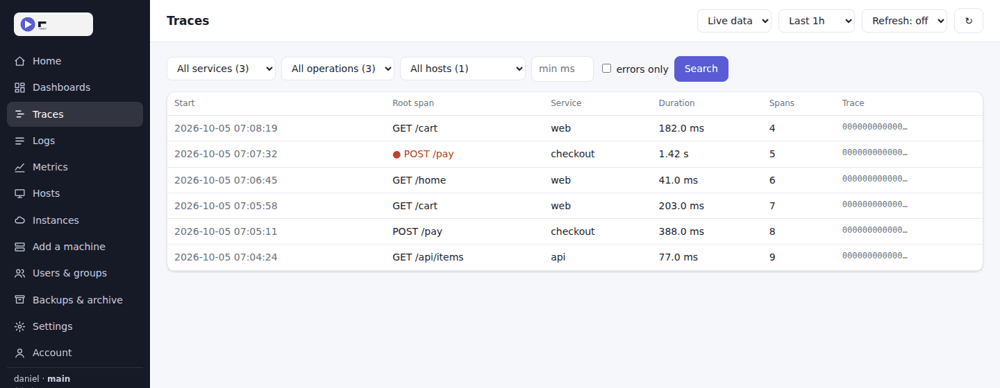 **Traces**: service, operation and host dropdowns. |
| 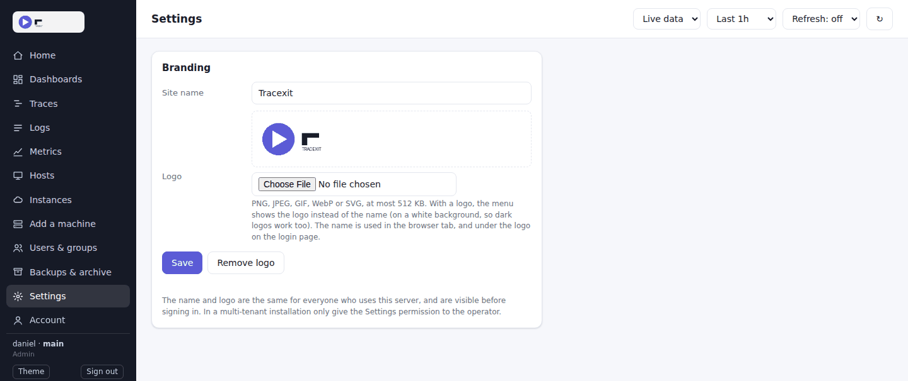 **Settings**: your own logo and site name. | 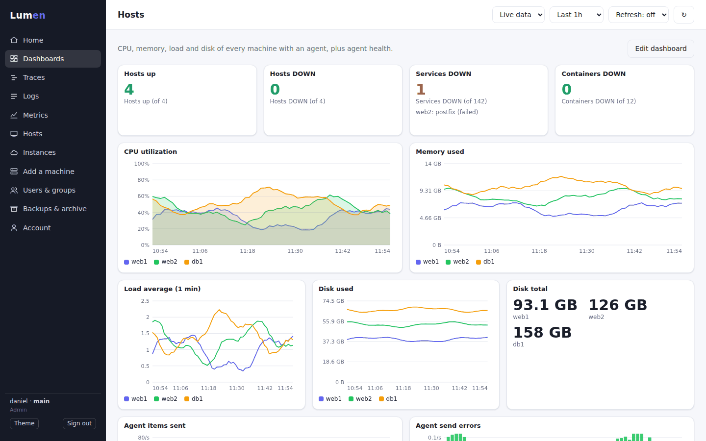 **Hosts dashboard** starter template. |
| 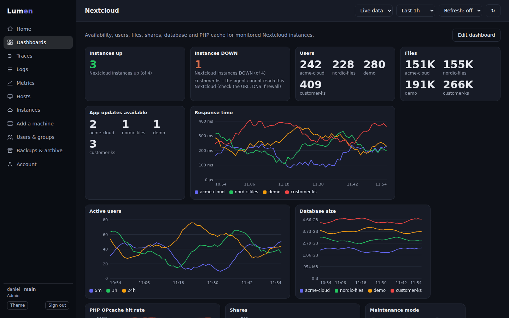 Light and dark theme. | |

*Screenshots show example data.*

## How it fits together

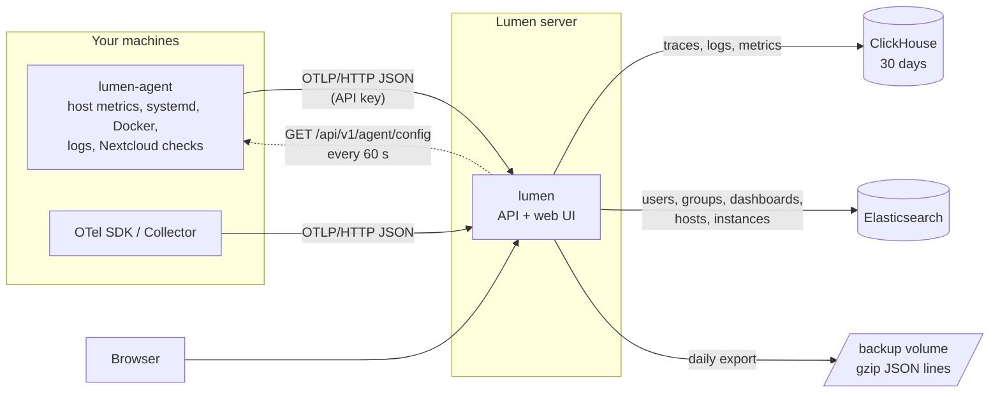

Telemetry lives in **ClickHouse**. Small, frequently changing records (users, groups, API keys, dashboards, host settings, instances) live in **Elasticsearch**, or in a JSON file for a single small instance.

## Quick start

```bash
git clone https://github.com/danielingemar/lumen.git
cd lumen
```

Needs Docker with the compose plugin and about 8 GB RAM (Elasticsearch + ClickHouse). On Linux hosts Elasticsearch needs `vm.max_map_count=262144` (Docker Desktop on Mac/Windows handles it itself).

```bash
sudo sysctl -w vm.max_map_count=262144                                   # Linux only
echo 'vm.max_map_count=262144' | sudo tee /etc/sysctl.d/99-lumen.conf    # keep it after reboot
./dev.sh                      # auto-detects your LAN IP
./dev.sh --ip 192.168.56.1    # or choose the address your VM can reach
```

It starts Lumen, ClickHouse and Elasticsearch, prints the web UI address, the `admin` login and ready-to-paste commands for other machines. `./dev.sh status | stop | reset` manage it.

If a VM cannot connect, use an IP it can reach (bridged: your LAN IP; NAT/host-only: the host address of that network) and allow inbound TCP 4318.

## Install on a server

Rocky Linux / AlmaLinux / RHEL 9, or any host with Docker. 2+ vCPU, 6 GB RAM minimum (8 GB+ recommended), 20 GB+ local SSD.

```bash
sudo sysctl -w vm.max_map_count=262144
echo 'vm.max_map_count=262144' | sudo tee /etc/sysctl.d/99-lumen.conf
sudo ./install.sh --public-url https://lumen.example.com --tenant main
```

Installs Docker if missing, generates secrets into `deploy/.env`, runs a preflight check, starts everything, waits until healthy and prints the address and the admin login. Add `--allow-podman-removal` if podman is installed. Manual steps: `deploy/install-rhel-family.sh`, `deploy/gen-env.sh`, `deploy/preflight.sh`, `make up`.

**Keep `deploy/.env` safe.** It holds `LUMEN_SECRET_KEY`, which encrypts stored Nextcloud credentials; without it they cannot be read again.

Production notes:
- **Use HTTPS.** API keys travel in headers and Nextcloud tokens are sent to agents. Put Nginx/Caddy in front and set `LUMEN_BIND=127.0.0.1` in `deploy/.env`. Docker-published ports usually bypass firewalld, so do not rely on it alone.
- Set `--public-url` to the address agents will use; it is written into the install scripts.
- If agents reach Lumen through a proxy such as Squid, exempt the Lumen host.

### Upgrade

Full step-by-step guide, including how to upgrade with read-only access: **[UPGRADING.md](UPGRADING.md)**. In short:

The menu shows the build of the running server (`build 3fa91c2d`); agents built from the same source report the same value, and the Hosts page marks agents that differ with **update**. Pull the new source and run `./install.sh` (or `./dev.sh`) again: it adds missing settings such as `LUMEN_SECRET_KEY` to `deploy/.env`, rebuilds and restarts. **Your address and other settings in `deploy/.env` are never replaced**: `LUMEN_PUBLIC_URL` only changes if you pass `--public-url` (or `--ip` to `dev.sh`), and `LUMEN_BIND` is only set when missing. Several Lumen servers with different addresses can therefore be upgraded the same way. To upgrade without running any script at all: `docker compose -f deploy/docker-compose.yml up -d --build`. Existing data is kept, retention changes are applied to existing tables, and accounts from before groups existed become admins. **Run the agent install command once more on each machine** to get the current agent.

## Add machines

In the UI open **Add a machine**, create an agent key (for example `web-server-1`), choose the machine type and copy the command. The key is shown once; the commands already contain it.

| Type | Command | What it does |
|---|---|---|
| **Linux server** | `curl -fsSL URL/install/agent.sh \| sudo sh -s -- --key KEY` | systemd service as an unprivileged `lumen-agent` user. Options: `--logs '/var/log/*.log'`, `--docker-logs`, `--docker` |
| **Windows** | `& ([scriptblock]::Create((irm URL/install/agent.ps1))) -Key KEY` (elevated PowerShell) | Scheduled task running as SYSTEM, restarts on failure. Option: `-LogPath` |
| **Docker host** | a `docker run ... alpine:3.20 sh -c 'wget -qO- URL/install/agent-docker.sh \| sh'` command | Agent as a container; downloads and checksum-verifies at start. Nothing to build |
| **Nextcloud** | add the instance on the **Instances** page | see [Nextcloud monitoring](#nextcloud-monitoring) |
| **Download files** | links with SHA-256 | raw binaries for manual installs |

Remove an agent with `--uninstall` (Linux), `-Uninstall` (Windows) or `docker rm -f lumen-agent`.

`--docker` adds the agent to the `docker` group so it can list containers. **Docker socket access is equivalent to root on that machine**; only use it if you want container up/down status. The Windows script and the Docker-container agent do not collect services yet.

Agents report their own health (`service.name=lumen-agent`): uptime, items sent, send errors, scrape errors, refused log paths. Set `"metrics_listen": "127.0.0.1:9464"` to also expose `/metrics`. An agent that cannot reach Lumen cannot say so: watch for a missing `lumen_agent_info` (the *Hosts DOWN* box does this).

## Hosts, instances and remote configuration

- **Hosts** lists every machine with an agent: status, **IP address**, agent version, OS, services and containers up/down. The agent reports the address it uses to reach Lumen (the one to show first) plus its other addresses; loopback, link-local and container-bridge addresses (docker0, br-…, veth…) are left out. Agents installed before this feature must be updated (run the install command again) before an address shows up. A container agent reports the container's own address, not the host's. Open a host to **rename** it (a display name, useful when a container agent reports a random ID; the real name stays and is what agents and instances use), **remove** it from the list (only when it is not reporting, and not while Nextcloud instances are still checked by it; it comes back by itself if its agent reports again), set the **log files to ship**, Docker log shipping, **services that must be running** (shown DOWN when stopped or missing), and to switch service/container reporting on or off.
- **Instances** manages the Nextcloud installations to monitor. **Click an instance** for its own page: status and the reason when it is down, Nextcloud/PHP/database versions, users, files, shares, storage, database size, free data space, active users, response time, availability and PHP cache as charts, and the instance's own log. Users, files and the rest need a serverinfo token or login; the page says so when they are missing or the token is wrong. Managing: URL, token or login, optional log file, and *which machine's agent runs the checks*.
- Agents fetch `GET /api/v1/agent/config?host=NAME` (API key only) every 60 s and restart their collectors when it changes. Nothing to edit on the machines. Settings from the agent's local config and flags still work and are merged; an instance defined in the UI replaces a local one with the same URL.
- **Safety:** log paths that come from the server are only read if they are under `/var/log`, `/var/lib/docker/containers`, `/var/lib/docker/volumes`, `/var/www`, `/srv`, `/mnt` or `/opt`, and never contain `..`. Otherwise a UI user could make every agent read `/etc/shadow`. Change it per machine with `allowed_log_dirs` in the agent config (`["*"]` allows all). Paths in the local config file are always trusted. Refused paths show as a warning on the host.
- Nextcloud tokens are stored **encrypted** (AES-GCM, key from `LUMEN_SECRET_KEY`) and never shown again in the UI (only "set"). They are sent to the agent that needs them, hence HTTPS.
- **Services:** systemd units that are running or failed, plus watched ones, as `system_service_up`. **Containers:** `container_up` through the Docker Engine API on the local socket.

## Nextcloud monitoring

One agent can watch several Nextcloud instances from anywhere that can reach their URL. Per instance it collects:

- availability and response time (`status.php`), maintenance mode, pending DB upgrade, version;
- with a token: active users (5 min / 1 h / 24 h), user / file / storage counts, shares by type, installed apps and available updates, database size, PHP memory limit, OPcache hit rate and usage, free data space;
- optionally `nextcloud.log` as structured logs (level, app, user and request id are kept; the request URL is dropped because it can contain tokens).

Create a token on the Nextcloud server (the *serverinfo* app is on by default):

```bash
docker exec -u www-data <nextcloud-container> php occ config:app:set serverinfo token --value 'A_LONG_RANDOM_STRING'
# without Docker:  sudo -u www-data php occ config:app:set serverinfo token --value '...'
```

Then add the instance under **Instances**. The Nextcloud hostname must be in that instance's `trusted_domains`. An admin user plus app password works instead of a token. Instances set up earlier with `--nextcloud` flags still work and appear as "from agent flags" with a *Manage here* button.

> The serverinfo field names follow the app's documented response and are tested against a sample of that shape, not a live server. Compare the numbers with one real instance first; missing fields are skipped.

## What the agent reports about a host

Reported every collection interval (15 s by default); rates are calculated by the agent from the difference between two samples. Linux agents report everything below; Windows agents report CPU, memory and disk usage.

| Metric | Labels | Meaning |
|---|---|---|
| `system.cpu.utilization` | | share of time the CPU was busy (0-1); iowait counts as idle |
| `system.cpu.state` | `state` = user, nice, system, iowait, irq, steal | share of time per state (0-1) |
| `system.cpu.count` | | number of CPUs |
| `system.load.1m` / `5m` / `15m`, `system.load.average` | `period` | load average |
| `system.memory.total`, `used`, `available` | | bytes (`used` = total minus available) |
| `system.memory.usage` | `state` = used, cached, buffers, free | bytes; the four add up to the total |
| `system.paging.total`, `system.paging.usage` | `state` = used, free | swap, bytes (0 on a machine without swap) |
| `system.filesystem.total`, `used`, `utilization` | `mountpoint`, `device`, `fstype` | every local disk: bytes and share used (0-1). Network file systems, containers' overlay mounts and pseudo file systems are left out; at most 16 |
| `system.filesystem.inodes.utilization` | same | share of inodes used (0-1) |
| `system.disk.io.bytes_rate`, `system.disk.io.ops_rate` | `device`, `direction` = read, write | bytes and operations per second |
| `system.disk.utilization` | `device` | share of time the disk was busy (0-1). Whole disks only (not partitions, loop devices) |
| `system.network.io.bytes_rate`, `system.network.packets_rate` | `device`, `direction` = receive, transmit | per second; physical interfaces only (not lo, docker0, veth…) |
| `system.network.errors_rate` | `device`, `kind` = errors, drops | per second |
| `system.processes.count`, `system.processes.running` | | processes |
| `system.uptime` | | seconds since boot |

Names that existed before (`system.cpu.utilization`, `system.memory.used/total`, `system.load.*m`, `system.filesystem.used/total`) keep working, so existing dashboards are unaffected. Disk usage for `/` now also carries the `device` and `fstype` labels. All of these are ordinary metrics: use them in the Metrics explorer and in your own dashboards. After upgrading the server, run the agent install command again on each machine to get the new metrics.

## Status and "Down"

Status panels (a single-value panel with data source **Status**, and the boxes on **Home**) show counts of up and down hosts, services, containers and Nextcloud instances.

- A **host** is down when its agent has not reported for 2 minutes.
- **Services and containers** are only counted on hosts that report (when a host is down, the host is the problem).
- A **Nextcloud instance** is down when its agent cannot reach it, or when the agent stopped reporting. A newly added instance gets 5 minutes to deliver its first check ("starting").
- Zero is shown in green. Clicking a box opens the Hosts or Instances page.

## Dropdowns on Traces, Logs and Metrics

The filter boxes list what Lumen has actually received, with counts, so you do not have to remember names:

- **Traces:** service, root operation (narrowed to the chosen service) and host.
- **Logs:** log source (the service name, for example `nginx` or `system-logs`) and host. The log-volume chart follows the same filters.
- **Metrics:** one dropdown with every metric of the last week, plus a filter box above it.

On live data the lists cover the last 7 days (not just the chart range, so something that stopped an hour ago is still listed); with the Archive switch or a custom range they follow that range. Host names come from the `host.name` that agents send, shown with the display name you gave them on the Hosts page. Lists are cached for a minute.

## Settings: your logo and name

**Settings** (needs the *Settings* permission) lets you upload a logo (PNG, JPEG, GIF, WebP or SVG, up to 512 KB) and a site name. With a logo the menu shows the logo (on a white background so dark logos work) and the browser tab icon becomes the logo, fitted into a square; the name is used in the tab title and under the logo on the login page. Without a logo the tab shows a built-in Lumen icon. They are the same for everyone on this server and visible before signing in, so in a multi-tenant installation only give the Settings permission to the operator.

Uploads are checked by their real content (not the declared type), SVG files with scripts or event handlers are refused, and the logo is served with a locked-down content-security policy so it can never run code.

## Alerting

Lumen can tell people when something is wrong. **Alerts** in the menu has five tabs: *Active* (what is firing now, with Acknowledge and Silence), *Rules*, *Channels*, *Silences* and *History*.

**Set it up in three steps**

1. **Channels, then Add channel.** Choose where messages go (email, webhook, Slack, Teams; Enterprise adds Jira, ServiceNow, PagerDuty and Opsgenie), fill in the form, save, and press **Test**. Secrets (passwords, tokens, webhook URLs) are encrypted and never shown again.
2. **Rules, then Starter rules.** Add the ready-made rules you want (host down, Nextcloud instance down, service failed, container down, disk almost full, high CPU, slow Nextcloud, many errors in the logs), or **+ Add rule** to make your own.
3. Done. When a rule's condition holds for long enough, an alert fires and every channel that wants it is told.

**Rules** can be of three kinds: a **metric** (for example the highest disk use over 5 minutes above 90 percent, one alert per mount point), the **up/down status** of hosts, services, containers or Nextcloud instances, or the **number of log lines** (for example more than 20 errors in 5 minutes). A rule has an importance (critical, warning, info), a time the condition must last before it fires, how often to check, what to do when there is no data, a message and extra labels. **Preview on the last 24 hours** replays a metric or log rule over history and shows when it would have fired, so you can choose a threshold before you save.

**How alerts behave**

- *pending* (the condition is true, not yet for long enough) then *firing*, then *resolved* once the condition has been false for two checks in a row, so a value that hovers around the threshold does not flap.
- Alerts that belong together (one rule, several hosts) are sent as **one message** after a short wait (30 s).
- A firing alert is announced again every 4 hours until someone **acknowledges** it. Acknowledging does not resolve it; it only stops the reminders.
- A **silence** mutes alerts whose labels match, for a while (planned work, for example). Silenced alerts are still evaluated and shown, but nothing is sent.
- A failed delivery is retried after 10 s, 30 s, 2 min, 10 min and 30 min, and the **History** tab shows every attempt, including the ones Lumen gave up on. A channel that keeps failing is marked FAILING.
- A check that cannot run (for example the database is down) never resolves alerts; the rule shows why it cannot be checked.
- State is kept, so a restart does not send everything again, and an alert that fired but was never delivered is sent after the restart.

**Channels**

| Channel | Edition | Notes |
|---|---|---|
| Email (SMTP) | Community | STARTTLS, TLS or none; login optional |
| Webhook | Community | JSON, signed with `X-Lumen-Signature` (sha256 HMAC of `timestamp.body`) so the receiver can verify it |
| Slack, Microsoft Teams | Community | Incoming webhooks (https) |
| Heartbeat | Community | Lumen calls a URL regularly; an outside service tells you when the calls stop, which means Lumen itself is down |
| PagerDuty, Opsgenie | Enterprise | One event or alert per alert; closed when it resolves |
| Jira, ServiceNow | Enterprise | A ticket is created, commented on at each reminder and closed when the alert resolves |

Each channel can be limited to some importances (for example only critical) and to alerts with certain labels (for example `host=web1`).

**Security.** Channels make the server connect to addresses that users type. Lumen therefore **refuses loopback, private, link-local and cloud-metadata addresses** (checked on the real connection, so also after name resolution and redirects). To use an internal mail relay or an internal webhook receiver, an administrator sets `LUMEN_ALERT_ALLOW_PRIVATE=true`; the cloud-metadata address (169.254.x.x) stays blocked even then. Mail headers are built from validated fields only (no header injection), secrets are encrypted and never returned, errors never contain a webhook URL, and every change is audited in the server log. Permissions: **Alerts** (read or write: rules, silences, acknowledging) and **Notification channels** (read or write; kept separate because channels hold secrets and send from the server). The built-in *User* group can read alerts but not see channels.

**What is not there yet:** rules on traces (error rate, latency), escalation policies and on-call schedules, recurring maintenance windows, message templates, assigning an alert to a person, and metrics about the alert engine itself. See the [design](docs/design/alerting.md). A single server runs the evaluation; there is no high-availability mode yet.

## Labels

Every metric point carries labels: key=value tags such as `host`, `instance`, `mountpoint` or `core`. You find them in two places: the **Metrics** page has a *Labels* box for the chosen metric (click a name to split the chart, a value to filter), and the panel editor offers them under *Split by* and *Only where*.

## Users, groups and permissions

Managed under **Users & groups**:

- **Admin**: everything, including users, groups, keys and backups.
- **User**: read-only access to data, dashboards, hosts and instances.
- **Custom**: an admin picks *none / read / write* for each area: dashboards, traces, logs, metrics, hosts & instances, agent keys, users & groups, backups & archive, settings. Traces, logs and metrics are read-only by nature.

The server enforces permissions on every request; the UI just hides what you cannot use. API keys (agents, scripts) can read data and manage dashboards, never users or keys. Safeguards: you cannot delete yourself, change your own group, or remove the last user who can manage users. A group change applies immediately; resetting a password ends that user's sessions. New passwords are generated and shown once.

```bash
lumen users add alice --tenant main --group admin|user|GROUP_ID    # default group: user
lumen users set-group alice GROUP
```

## Login, keys and security

- **People log in with username and password.** Passwords are salted PBKDF2-HMAC-SHA256 (600,000 iterations); sessions are signed HttpOnly `SameSite=Strict` cookies (12 h, `Secure` over HTTPS); logins are throttled per username (10 failures / 10 min); changing a password ends that user's sessions.
- **Machines use API keys**, stored only as SHA-256 hashes (shown once). A browser session can never send telemetry. You can also sign in to the UI *with* an API key: that session reads data and uses dashboards but cannot manage keys, users or passwords, and ends when the key is deleted.
- **Storage:** users, groups, key hashes, dashboards, host settings, instances and the session secret live in Elasticsearch (`lumen-users`, `-groups`, `-keys`, `-dashboards`, `-hosts`, `-instances`, `-meta`). Writes are single-document with optimistic concurrency (two people saving the same dashboard cannot silently overwrite each other). Elasticsearch has no multi-document transactions. Without `LUMEN_ELASTICSEARCH_URL` Lumen uses a JSON file (`documents.json`, mode 0600).
- The first admin is created at startup from `LUMEN_ADMIN_USER` / `LUMEN_ADMIN_PASSWORD` / `LUMEN_ADMIN_TENANT`. Changing the password in `.env` later has no effect; use the UI or CLI. Locked out? `docker compose -f deploy/docker-compose.yml exec lumen /lumen users passwd admin`.
- **Licensing note:** Elasticsearch is not Apache-licensed (Elastic License 2.0 / SSPL, plus AGPL from 8.16). Running it as a separate service is fine; read the terms before redistributing it or offering a hosted service. Lumen only uses basic document and search APIs, so **OpenSearch** (Apache-2.0) should work by pointing `LUMEN_ELASTICSEARCH_URL` at it (not tested).

CLI (also works while the server runs):

```bash
docker compose -f deploy/docker-compose.yml exec lumen /lumen users list
docker compose -f deploy/docker-compose.yml exec lumen /lumen users add alice --tenant main
docker compose -f deploy/docker-compose.yml exec lumen /lumen users passwd alice
docker compose -f deploy/docker-compose.yml exec lumen /lumen users delete alice
docker compose -f deploy/docker-compose.yml exec lumen /lumen keys create --tenant main --name vm1
```

## Retention, backup and archive

Live data stays in ClickHouse for `LUMEN_RETENTION_DAYS` (**30**); changing the value also updates existing tables at startup. Before data expires, every completed UTC day is exported once per tenant and table as gzip JSON lines:

```
/backup/telemetry/YYYY-MM-DD/<tenant>/otel_{spans,logs,metrics}.jsonl.gz   (+ a DONE marker, written last)
/backup/config/lumen-config-YYYY-MM-DD.json.gz    users, groups, dashboards, hosts, instances (last 30)
```

Backups are kept `LUMEN_BACKUP_RETENTION_DAYS` (**365**; `0` = forever). A failed export leaves no partial day and is retried.

**Looking at an old day:** open **Backups & archive**, choose *View in archive* (the day is loaded into `*_archive` tables that never expire), and Lumen switches the top bar to **Archive** with a custom time range. Traces, logs, metrics and dashboards then show that day. Switch back with *Back to live data*, and *Unload* when done. The raw files can also be downloaded or read directly: `zcat .../otel_logs.jsonl.gz | less`.

> The config dump contains **all tenants** (password hashes, encrypted credentials) and is for the operator only; it is never served by the API.
>
> **The backup lives on the same server as the data.** Copy it elsewhere regularly, for example from cron:
> `docker compose -f deploy/docker-compose.yml cp lumen:/backup ./lumen-backup`

## Configuration

**Server (environment)**

| Variable | Default | Meaning |
|---|---|---|
| `LUMEN_ADDR` | `:4318` | listen address |
| `LUMEN_PUBLIC_URL` | | address agents use; written into the install scripts |
| `LUMEN_CLICKHOUSE_URL` / `_DB` / `_USER` / `_PASSWORD` | `http://localhost:8123` / `lumen` / `default` / | ClickHouse |
| `LUMEN_RETENTION_DAYS` | `30` | days of live data |
| `LUMEN_BACKUP_DIR` | `/backup` | daily export of expiring data; empty disables backups |
| `LUMEN_BACKUP_RETENTION_DAYS` | `365` | how long backups are kept; `0` = forever |
| `LUMEN_ALERTS` | `true` | `false` switches alerting off |
| `LUMEN_ALERT_ALLOW_PRIVATE` | `false` | let alert channels reach loopback and private addresses (an internal mail relay or webhook receiver) |
| `LUMEN_ALERT_GROUP_WAIT` | `30s` | how long related alerts are collected into one message |
| `LUMEN_ALERT_REPEAT` | `4h` | how often a firing alert is announced again until acknowledged |
| `LUMEN_SECRET_KEY` | | encrypts stored Nextcloud credentials (falls back to the session secret with a warning) |
| `LUMEN_ELASTICSEARCH_URL` / `_USER` / `_PASSWORD` / `_API_KEY` / `_PREFIX` | / / / / `lumen` | document store; without a URL a JSON file in `LUMEN_DATA_DIR` (`/data`) is used |
| `LUMEN_ADMIN_USER` / `_PASSWORD` / `_TENANT` | / / `main` | first admin, created at startup |
| `LUMEN_API_KEYS` | | optional bootstrap keys, `key:tenant,key:tenant` |
| `LUMEN_DIST_DIR` | `/dist` | agent binaries served for installs |
| `LUMEN_DEV_MODE` | `false` | `true` disables authentication entirely (single tenant `default`); private test machines only |

If there are no users and no keys, nobody can log in and the server log says so.

**Agent:** a JSON file (`-config`, see `lumen-agent.example.json`) and/or environment variables (variables win): `LUMEN_AGENT_URL`, `LUMEN_AGENT_API_KEY`, `LUMEN_AGENT_INTERVAL`, `LUMEN_AGENT_HOST_METRICS`, `LUMEN_AGENT_SYSTEMD`, `LUMEN_AGENT_CONTAINERS`, `LUMEN_AGENT_LOG_PATHS`, `LUMEN_AGENT_DOCKER_LOGS`, `LUMEN_AGENT_METRICS_LISTEN`, `LUMEN_AGENT_NO_REMOTE` (ignore the server's settings), `LUMEN_AGENT_NEXTCLOUD_{URL,TOKEN,USER,PASSWORD,SERVICE,LOG}`. The agent also scrapes any Prometheus `/metrics` endpoint (`scrape` list), so node_exporter, cAdvisor and app exporters work unchanged.

## API

| Method | Path | Needs |
|---|---|---|
| POST | `/v1/traces`, `/v1/logs`, `/v1/metrics` | API key. OTLP/HTTP **JSON** only for now; gzip supported |
| POST | `/api/v1/login`, `/logout`, `/password` | login with `{"username","password"}` or `{"api_key"}` |
| GET | `/api/v1/me` | who am I: group, permissions, `via_key` |
| GET/POST/DELETE | `/api/v1/keys[/{id}]` | keys |
| GET/POST/PUT/DELETE | `/api/v1/users[/{name}]`, `/api/v1/groups[/{id}]` | users |
| GET | `/api/v1/series` | traces / logs / metrics. `source=metric\|traces\|logs`; metric: `name`, `agg=avg\|sum\|min\|max\|last\|rate`, `filter=label:value` (up to 5), `group_by`; traces: `metric=requests\|rps\|errors\|error_rate\|avg\|p50\|p95\|p99`; logs: `severity`, `q`; plus `service`, `from`, `to`, `step` (max 90 days) |
| GET | `/api/v1/services`, `/metrics/names`, `/metrics/labels?name=` | any of traces, logs, metrics |
| GET | `/api/v1/traces` (`service`, `host`, `operation`), `/traces/{id}`, `/logs` (`service`, `host`, `severity`, `q`) | traces / logs |
| GET/POST/PUT/DELETE | `/api/v1/dashboards[/{id}]` | dashboards (`version` for conflict detection) |
| GET | `/api/v1/status` | hosts or metrics: up/down counts, instances, what is down |
| GET/PUT/DELETE | `/api/v1/hosts[/{host}]` (PUT takes `display_name`) | hosts |
| POST | `/api/v1/hosts/{host}/remove` | hosts |
| GET | `/api/v1/facets?source=traces\|logs[&service=]` | traces / logs: services, hosts and operations that have data |
| GET | `/api/v1/branding`, `/branding/logo` | none (public) |
| PUT | `/api/v1/settings/branding` | settings |
| GET/POST/PUT/DELETE | `/api/v1/instances[/{id}]` | hosts |
| GET | `/api/v1/alerts` | alerts (also `counts`) |
| POST, DELETE | `/api/v1/alerts/ack/{fingerprint}` | alerts (write) |
| GET/POST/PUT/DELETE | `/api/v1/alerts/rules[/{id}]` | alerts |
| POST | `/api/v1/alerts/backtest` (`{rule, hours}`) | alerts, plus metrics or logs read |
| GET | `/api/v1/alerts/templates`, `/alerts/history` | alerts |
| GET/POST/DELETE | `/api/v1/alerts/silences[/{id}]` | alerts |
| GET | `/api/v1/alerts/deliveries` | notification channels |
| GET | `/api/v1/notifications/types` | notification channels (field definitions the form is built from) |
| GET/POST/PUT/DELETE | `/api/v1/notifications/channels[/{id}]`, POST `.../{id}/test` | notification channels |
| GET | `/api/v1/agent/config?host=` | API key (never a browser session: contains credentials) |
| GET, POST, DELETE | `/api/v1/backups`, `/backups/run`, `/backups/{day}/load`, `/backups/{day}/{spans\|logs\|metrics}` | backups |
| any read | `?archive=1` | backups (read): query restored data |
| GET | `/install/agent.sh`, `/install/agent.ps1`, `/install/agent-docker.sh`, `/download/{file}` | none; contain no secrets |

OpenTelemetry SDKs and the Collector can send directly: exporter encoding `json`, endpoint `http://lumen:4318`, header `Authorization: Bearer KEY`.

## Development

```
cmd/lumen             server                    cmd/lumen-agent    agent
internal/server       HTTP API, UI and installer routes, permission gate
internal/store        ClickHouse over HTTP (no driver), archive tables, backup export/import
internal/otlp         OTLP JSON decoding
internal/agent        host metrics, systemd, Docker, Prometheus scrape, log tailing, Nextcloud, remote config
internal/install      embedded install scripts + agent download handler
internal/ui           single-file web UI
internal/auth         users, groups, passwords, sessions, API keys (on top of docstore)
internal/perm         permission areas and levels
internal/registry     host settings and Nextcloud instances (secrets encrypted)
internal/secretbox    AES-GCM for stored credentials
internal/status       up/down computation
internal/alerts       alert rules, state machine, notifications (email, webhook, Slack, Teams, heartbeat), SSRF guard
internal/backup       daily export, prune, load/unload of archive days
internal/docstore     Elasticsearch client + JSON-file fallback (estest = fake ES, tests only)
internal/dashboards   dashboards per tenant
internal/edition      open-core hooks (auth, authorization)
ee/                   enterprise features (commercial license, build tag "enterprise"): Jira, ServiceNow, PagerDuty, Opsgenie
deploy/               compose file, preflight, secrets generator, RHEL-family Docker installer
install.sh dev.sh     server installer / local test setup
```

```bash
make test          # go vet ./... && go test ./...
make build         # bin/lumen and bin/lumen-agent
make build-ee      # enterprise build
```

The SQL (DDL, queries, backup export/import round trip, retention) is also run against a real ClickHouse engine:

```bash
pip install chdb
LUMEN_DUMP_SQL=/tmp/sql.json go test ./internal/store -run Dump && python3 scripts/test-sql.py /tmp/sql.json
```

Only the Go standard library is used, so there is nothing to download. The Elasticsearch client is tested against a small fake (`internal/docstore/estest`), not a real Elasticsearch.

## Contributing

Issues and pull requests are welcome: see [CONTRIBUTING.md](CONTRIBUTING.md). Report security problems privately, see [SECURITY.md](SECURITY.md). Changes are listed in [CHANGELOG.md](CHANGELOG.md).

Before you fork this into a product of your own: pick the final name and check it for trademark conflicts, and add your commercial terms to `ee/LICENSE` (or delete `ee/` and `cmd/lumen/enterprise.go` if you do not want an enterprise tier). To rename the Go module: `./scripts/set-module.sh github.com/YOU/lumen`.

## Editions and design documents

Lumen is open core: a free **Community** edition, **Enterprise** for governance and scale, and an **Operator** add-on for running Lumen for customers or business units. The line between them is written down as a public charter, with promises such as "a released Community feature is never moved to a paid edition". These are **drafts** for discussion; nothing in them is implemented yet unless the text says *exists*.

| Document | English | Svenska |
|---|---|---|
| Edition charter | [docs/EDITIONS.md](docs/EDITIONS.md) | [docs/EDITIONS.sv.md](docs/EDITIONS.sv.md) |
| Design: tenancy (operator layer, quotas, metering, per-tenant retention and branding) | [docs/design/tenancy.md](docs/design/tenancy.md) | [docs/design/tenancy.sv.md](docs/design/tenancy.sv.md) |
| Design: alerting (rules, notifications, Jira and email, on-call) | [docs/design/alerting.md](docs/design/alerting.md) | [docs/design/alerting.sv.md](docs/design/alerting.sv.md) |

## Roadmap

1. **Alerting, next steps:** trace rules, escalation and on-call, maintenance windows, templates, self-monitoring metrics — see the [design](docs/design/alerting.md)
2. Windows services and Windows Event Log in the agent
3. Protobuf and gRPC OTLP ingest
4. Dashboard variables and sharing, service map, span details, correlation across traces, logs and deploys
5. Kubernetes discovery and a Helm chart for the agent
6. Server self-monitoring, per-tenant quotas, agent on-disk buffering
7. Enterprise and Operator features, see the [edition charter](docs/EDITIONS.md): SSO, audit log, ticket and on-call integrations, tenant console, quotas and metering

## License

Apache-2.0 for the core, see [LICENSE](LICENSE). `ee/` is separately licensed.
